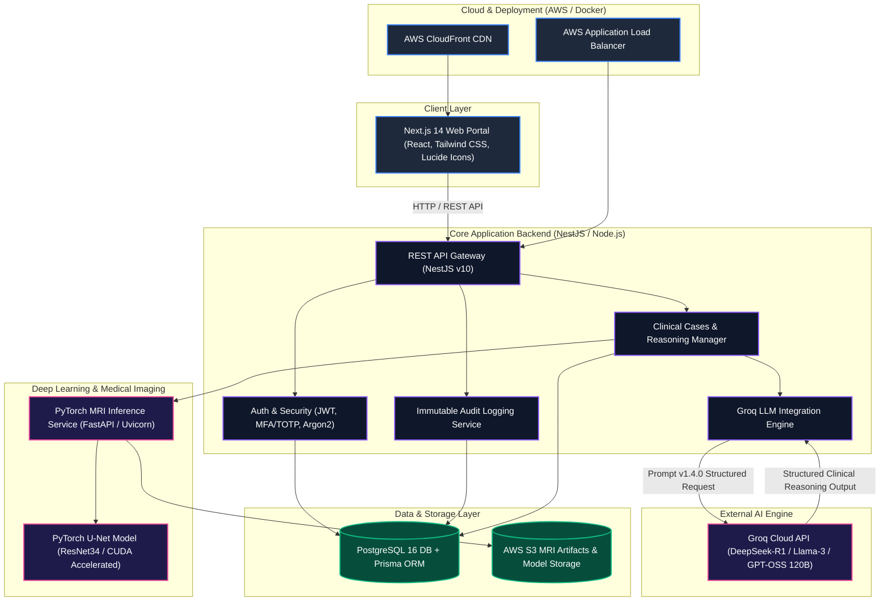

# 🏥 Clinical Decision Support System (CDSS)

[](https://github.com/TheProgrammer400/Clinical-Decision-Support-System)
[](https://github.com/TheProgrammer400/Clinical-Decision-Support-System/actions)
[](LICENSE)
[](https://nextjs.org/)
[](https://nestjs.com/)
[](https://pytorch.org/)
[](https://groq.com/)

> **AI-Assisted Probabilistic Differential Diagnostic & Brain MRI Segmentation Engine**

CDSS is an enterprise-grade clinical decision support application designed to assist healthcare professionals in analyzing complex clinical presentations, generating probabilistic differential diagnoses, identifying urgent red-flag medical conditions, and extracting quantitative lesion metrics from brain MRI scans using PyTorch deep learning models.

---

## 📐 System Architecture



---

## ✨ Key Features & System Capabilities

* **🩺 Probabilistic Differential Diagnosis Engine**: Uses LLM-guided structured reasoning to evaluate patient history, presenting symptoms, and lab results into differential diagnostic considerations with likelihood percentages, supporting factors, and missing investigation alerts.
* **🧠 PyTorch U-Net Brain MRI Segmentation**: Computes objective volumetric lesion metrics (`area_percent`, `visual_width_span_percent`, bounding coordinates) on T1+C and T2 FLAIR brain MRI scans.
* **🚩 Urgent Red-Flag Identification**: Automatically scans clinical inputs for acute symptoms (e.g., elevated intracranial pressure, stroke signs, herniation risk) to alert clinicians immediately.
* **🔒 Enterprise Governance & Security**: 
  * Role-Based Access Control (`DOCTOR`, `ORG_ADMIN`, `SUPER_ADMIN`).
  * Argon2 password hashing, JWT token rotation, MFA/TOTP setup.
  * Comprehensive HIPAA/GDPR audit trail logging for all sensitive clinical operations.
* **☁️ Cloud-Native Infrastructure & CI/CD**:
  * Infrastructure-as-Code via Terraform for AWS deployment (VPC, ECS Fargate, ECR, RDS PostgreSQL, ALB, CloudFront, S3).
  * Automated GitHub Actions CI/CD pipelines with OIDC authentication to AWS.

---

## 🛠️ Technology Stack

| Layer | Technology |
| :--- | :--- |
| **Frontend UI** | Next.js 14 (App Router), React 18, Tailwind CSS, Lucide Icons |
| **Backend API** | NestJS (TypeScript), Prisma ORM, Node.js 20 |
| **Database** | PostgreSQL 16 |
| **Deep Learning Engine** | Python 3.10+, FastAPI, PyTorch (CUDA GPU Accelerated), OpenCV, Pillow |
| **LLM Provider** | Groq Cloud API (`openai/gpt-oss-120b` / `llama-3.3-70b`) |
| **Infrastructure as Code** | Terraform, AWS (VPC, ECS, ECR, RDS, S3, ALB, CloudFront) |
| **CI/CD** | GitHub Actions (OIDC AWS Integration) |

---

## 🚀 Quick Start Guide

### Prerequisites
- **Docker & Docker Compose** (v24.x+)
- **Node.js** (v20.x+)
- **Python** (v3.10+)

### Launching with Docker Compose (Recommended)

```bash
# 1. Clone repository
git clone https://github.com/TheProgrammer400/Clinical-Decision-Support-System.git
cd Clinical-Decision-Support-System

# 2. Set your Groq API Key (Optional for dev mock mode)
export GROQ_API_KEY="gsk_your_actual_groq_api_key_here"

# 3. Start all services
docker-compose up -d --build
```

### Access Points
| Service | URL |
| :--- | :--- |
| **Frontend Application** | [http://localhost:3000](http://localhost:3000) |
| **Backend REST API** | [http://localhost:4000/api/v1](http://localhost:4000/api/v1) |
| **Backend Health Check** | [http://localhost:4000/api/v1/health/ready](http://localhost:4000/api/v1/health/ready) |
| **MRI Inference Microservice** | [http://localhost:8000](http://localhost:8000) |
| **MRI Service Health** | [http://localhost:8000/health/ready](http://localhost:8000/health/ready) |

---

## 🔖 Versioning & Releases

This project adheres strictly to [Semantic Versioning (SemVer 2.0.0)](https://semver.org/). Version numbers follow the `MAJOR.MINOR.PATCH` specification:

1. **MAJOR**: Breaking API contract changes or core architectural overhauls.
2. **MINOR**: New diagnostic features, added deep learning models, or enhanced UI modules.
3. **PATCH**: Backward-compatible bug fixes, security patches, and performance updates.

### 📌 Subsystem Version Matrix

| Component / Subsystem | Current Version | Specification / Artifact |
| :--- | :--- | :--- |
| **CDSS Platform Core** | `v2.4.0-Stable` | Main Application Release |
| **Groq Reasoning Prompt Spec** | `v1.4.0` | `PROMPT_VERSION=v1.4.0` |
| **PyTorch U-Net Inference Engine** | `unet_v1.2.0` | `models/unet.pth` (`ResNet34`) |
| **NestJS API Gateway** | `v1.0.0` | Node.js 20 / NestJS v10 |
| **Prisma DB Schema** | `v1.1.0` | PostgreSQL 16 Schema |
| **AWS Terraform Infrastructure** | `v1.0.0` | ECS Fargate & CloudFront HCL |

### 📜 Release Changelog Overview

* **`v2.4.0-Stable`** *(Current)*
  * Integrated PyTorch U-Net GPU MRI segmentation pipeline into clinical case workflow.
  * Standardized Groq LLM v1.4 reasoning prompt schema with structured JSON fallback parsers.
  * AWS OIDC deployment workflow for automated GitHub Actions CD pipeline.
* **`v2.0.0`**
  * Migration to Next.js 14 App Router with custom dark theme system.
  * Added Argon2 password hashing, JWT refresh token rotation, and MFA/TOTP security modules.
* **`v1.0.0`**
  * Initial release of Clinical Decision Support System backend REST API and relational database schema.

---

## 📂 Project Structure

```
CDSS/
├── backend/                  # NestJS REST API Gateway
│   ├── src/
│   │   ├── modules/          # Auth, Users, Cases, MRI, Audit Logs, Health
│   │   ├── common/           # Filters, Interceptors, Guards, Decorators
│   │   └── main.ts           # Server entry point
│   └── prisma/               # Database schema & migrations
├── frontend/                 # Next.js 14 Frontend Application
│   ├── src/
│   │   ├── app/              # App router pages & layouts
│   │   ├── components/       # UI Components
│   │   └── lib/              # API Client & helpers
├── mri-inference-service/    # PyTorch FastAPI Inference Engine
│   ├── app/                  # FastApi routes & U-Net inference pipeline
│   └── models/               # PyTorch weights (.pth)
├── infrastructure/           # Terraform IaC configurations
│   └── terraform/            # AWS VPC, ECS, ECR, RDS, S3, ALB templates
└── .github/
    └── workflows/            # GitHub Actions CI & CD pipelines
```

---

## 🛡️ Regulatory & Legal Disclaimer

> **IMPORTANT:** This software is strictly intended as a **Clinical Decision Support System (SaMD Class II)** for use by licensed medical professionals. It does **not** provide automated or definitive medical diagnoses. Clinical judgment and final diagnostic responsibility remain solely with the attending physician.
